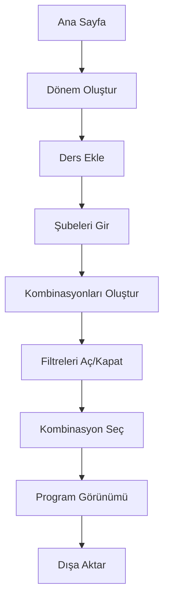
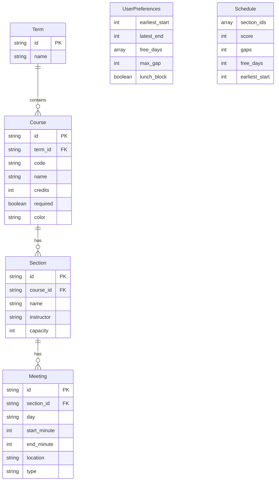
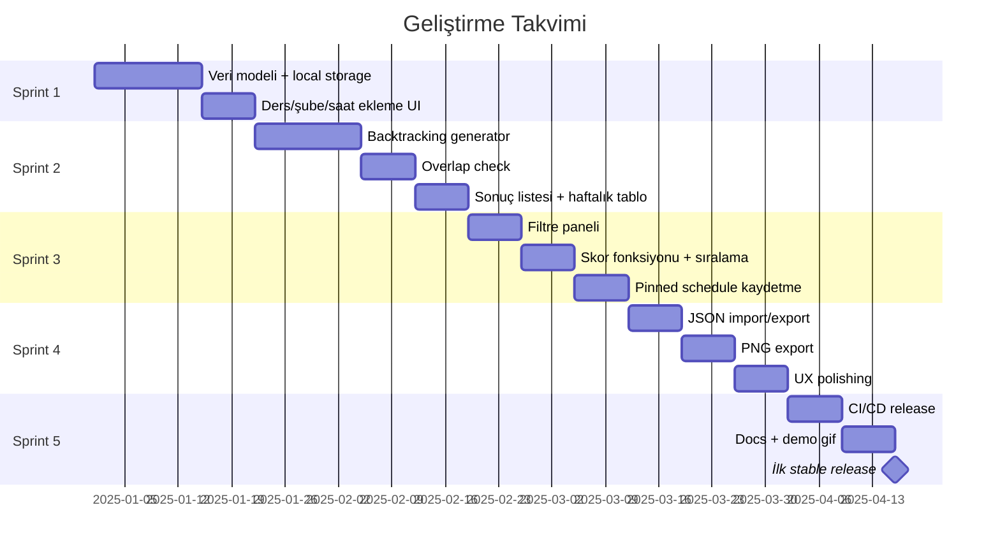

# Üniversite Ders Seçim Uygulaması - Uygulama Planı

> **Tek Cümle Özet:** Öğrencinin derslerini ve şube saatlerini girip, uygulamanın **tüm çakışmasız program kombinasyonlarını** üretmesi ve öğrencinin **filtreleyip en iyi programı seçmesi**.

---

## İçindekiler

1. [Kullanıcı Akışı (MVP)](#1-kullanıcı-akışı-mvp)
2. [Özellik Seti](#2-özellik-seti)
3. [Veri Modeli](#3-veri-modeli)
4. [Kombinasyon Motoru](#4-kombinasyon-motoru)
5. [Skorlama Sistemi](#5-skorlama-sistemi)
6. [UI/UX Tasarım Planı](#6-uiux-tasarım-planı)
7. [Teknik Stack](#7-teknik-stack)
8. [Proje Yapısı](#8-proje-yapısı)
9. [Open-Source Planı](#9-open-source-planı)
10. [Güvenlik & Etik](#10-güvenlik--etik)
11. [Geliştirme Roadmap](#11-geliştirme-roadmap)
12. [Risk Analizi & Çözümler](#12-risk-analizi--çözümler)

---

## 1. Kullanıcı Akışı (MVP)



### Adım Adım Akış

| Adım | Açıklama | Detay |
|------|----------|-------|
| **1** | Dönem oluştur | `2025-2026 Bahar` gibi |
| **2** | Ders ekle | Kod, ad, kredi, zorunlu/seçmeli |
| **3** | Şubeleri gir | Şube adı + birden çok ders saati bloğu |
| **4** | Kombinasyonları Oluştur | Tek buton ile tüm kombinasyonlar üretilir |
| **5** | Filtreleri aç/kapat | Liste dinamik olarak daralır |
| **6** | Kombinasyon seç | Haftalık tablo görünümü |
| **7** | Dışa aktar | PNG/PDF + ICS + JSON |

---

## 2. Özellik Seti

### MVP (İlk Sürüm - v0.1.0)

#### Temel CRUD Operasyonları
- [x] Ders ekleme, düzenleme, silme
- [x] Şube ekleme, düzenleme, silme
- [x] Saat bloğu ekleme (gün + saat aralığı)
- [x] Dönem yönetimi

#### Kombinasyon Üretimi
- [x] Çakışmasız kombinasyon algoritması
- [x] Backtracking + erken budama

#### Filtreleme Özellikleri

| Filtre | Açıklama | Durum |
|--------|----------|-------|
| **Erken Başlangıç** | En erken ders saati ≥ X | Tamamlandı |
| **Geç Bitiş** | En geç ders bitişi ≤ Y | Tamamlandı |
| **Boş Gün Sayısı** | Minimum boş gün | Tamamlandı |
| **Gün Bazlı Boşluk** | Belirli gün ders olmasın | Tamamlandı |
| **Öğle Arası** | 12:00–13:00 arası ders olmasın | Tamamlandı |
| **Maksimum Gap** | Gün içi maksimum boşluk | Tamamlandı |
| **Spread Minimize** | Toplam kampüste kalma süresi | Tamamlandı |

#### Diğer MVP Özellikleri
- [x] Kombinasyonları sıralama (skor bazlı)
- [x] Kaydet/yükle (local storage)
- [x] Minimal modern UI: tablo + liste + filtre paneli

---

### V2 (Çok Değer Katar - v0.2.0)

- [ ] **Ders Kısıtlamaları:** "Şu dersle birlikte alınamaz" kuralı (lab/teori eşleşmeleri)
- [ ] **Zorunlu Paket:** LAB seçince aynı dersin teorisi de seçilmeli
- [ ] **OBS Parse:** Hazır OBS'den kopyala-yapıştır parse (metin tablosu / HTML parse)
- [ ] **Çoklu Profil:** "Okul / Bölüm / Dönem" şablonları
- [ ] **Paylaşım:** Paylaşılabilir link/JSON

---

### V3 (Farklılaştırır - v1.0.0)

- [ ] **Tercih Öğrenme:** Kullanıcı seçimlerinden skor ağırlıklarını öğrenen basit model
- [ ] **Takvim Entegrasyonu:** ICS import desteği
- [ ] **Çakışma Açıklaması:** "Hangi bloklar çakıştı" detaylı gösterimi

---

## 3. Veri Modeli

### Şema Diyagramı



### Detaylı Tablo Yapıları

#### Course (Ders)
| Alan | Tip | Açıklama |
|------|-----|----------|
| `id` | string | Primary Key (UUID) |
| `code` | string | Ders kodu (örn: `CSE101`) |
| `name` | string | Ders adı |
| `credits` | int | Kredi değeri |
| `required` | boolean | Zorunlu mu? |
| `color` | string | Renk kodu (opsiyonel) |

#### Section (Şube)
| Alan | Tip | Açıklama |
|------|-----|----------|
| `id` | string | Primary Key |
| `course_id` | string | Foreign Key → Course |
| `name` | string | Şube adı (örn: `1. Şube`) |
| `instructor` | string | Öğretim görevlisi (opsiyonel) |
| `capacity` | int | Kontenjan (opsiyonel) |

#### Meeting (Ders Zamanı Bloğu)
| Alan | Tip | Açıklama |
|------|-----|----------|
| `id` | string | Primary Key |
| `section_id` | string | Foreign Key → Section |
| `day` | enum | `Mon, Tue, Wed, Thu, Fri, Sat, Sun` |
| `start_minute` | int | Başlangıç (örn: `9*60+30 = 570`) |
| `end_minute` | int | Bitiş dakika cinsinden |
| `location` | string | Derslik (opsiyonel) |
| `type` | enum | `Lecture, Lab, Recitation` |

> **Not:** Zamanı dakika cinsinden tutmak, filtre ve çakışma kontrolünü **çok kolaylaştırır**.

---

## 4. Kombinasyon Motoru

### Problem Tanımı

Her ders için seçilebilecek **birden fazla şube** var. Ancak şubelerin saatleri **çakışmayacak**. 

**Çıktı:** Tüm geçerli kombinasyonlar.

### Algoritma: Backtracking + Erken Budama

```
┌─────────────────────────────────────────────────────────────┐
│                    BACKTRACKING ALGORİTMASI                 │
├─────────────────────────────────────────────────────────────┤
│  1. Dersleri sırala: şube sayısı EN AZ olandan başla       │
│     → Branching azalır, performans artar                    │
│                                                             │
│  2. Her ders için:                                          │
│     a. Şube seç                                             │
│     b. Çakışma var mı? → Evet: dalı kes (pruning)          │
│                       → Hayır: sonraki derse geç           │
│                                                             │
│  3. Tüm dersler seçildi → Geçerli kombinasyon!             │
└─────────────────────────────────────────────────────────────┘
```

### Çakışma Kontrolü Yöntemleri

#### Yöntem 1: Bitset Yaklaşımı
```
Hafta = 7 gün × 24 saat × 60 dakika = 10080 bit
Her şube için dolu slotlar işaretlenir.
AND operasyonu ile çakışma kontrolü → O(1)
```

#### Yöntem 2: Interval List
```
Her gün için interval listesi tutulur.
Overlap check: (start1 < end2) && (start2 < end1)
```

### Performans Hedefi

| Senaryo | Ders Sayısı | Şube/Ders | Teorik Kombinasyon | Hedef Süre |
|---------|-------------|-----------|-------------------|------------|
| **Tipik** | 6-10 | 2-6 | ~100K+ | < 100ms |
| **Ağır** | 12+ | 5+ | Milyonlarca | < 1s |

### Filtreleme Zamanlaması

| Filtre Tipi | Ne Zaman Uygulanır? | Açıklama |
|-------------|---------------------|----------|
| Erken başlangıç | ⚡ Kombinasyon sırasında | Şube eklerken kontrol |
| Geç bitiş | ⚡ Kombinasyon sırasında | Şube eklerken kontrol |
| Boş gün | 🔄 Kombinasyon sonrası | Tam program gerekli |
| Gap hesabı | 🔄 Kombinasyon sonrası | Tüm slotlar bilinmeli |

---

## 5. Skorlama Sistemi

### Temel Skor Formülü

```
Skor = (boş_gün × w1) + (erken_başlangıç × w2) - (günlük_gap × w3) 
       - (toplam_spread × w4) + (tercih_günler × w5)
```

### Ağırlık Parametreleri

| Parametre | Varsayılan Ağırlık | Açıklama |
|-----------|-------------------|----------|
| `w1` (Boş Gün) | 100 | Her boş gün için +100 puan |
| `w2` (Erken Başlangıç) | 10 | Geç başlayan ders = daha iyi |
| `w3` (Günlük Gap) | -5 | Her dakika boşluk için -5 puan |
| `w4` (Spread) | -2 | Kampüste kalma süresi minimize |
| `w5` (Tercih Gün) | 50 | Tercih edilen günler için bonus |

### UI'da Slider ile Özelleştirme

```
┌────────────────────────────────────────┐
│  Skor Ağırlıkları                      │
├────────────────────────────────────────┤
│  Boş Gün Önceliği    ████████░░  80%   │
│  Erken Ders Kaçınma  ██████░░░░  60%   │
│  Minimum Boşluk      ████░░░░░░  40%   │
│  Kampüste Az Kalma   ███░░░░░░░  30%   │
└────────────────────────────────────────┘
```

> **İpucu:** Slider ile kullanıcıya "kendi programını optimize ediyormuş" hissi ver!

---

## 6. UI/UX Tasarım Planı

### Tasarım Prensipleri

> [!IMPORTANT]
> **Minimal ve Profesyonel Tasarım Kuralları**

| Kural | Açıklama |
|-------|----------|
| **Emoji Kullanma** | UI'da emoji kullanılmayacak, sadece standart ikonlar |
| **Gradient Yok** | Gradient renkler yasak, düz (solid) renkler kullanılacak |
| **Minimal Palet** | Maksimum 3-4 ana renk, nötr tonlar ağırlıklı |
| **Temiz Tipografi** | Sans-serif font (Inter, SF Pro, Segoe UI) |
| **Whitespace** | Bol boşluk, sıkışık tasarım yok |
| **Profesyonel Görünüm** | Kurumsal/akademik hissiyat, "oyuncak" görünümü yok |

### Renk Paleti (Minimal)

```css
/* Ana Renkler - Düz (Solid), Gradient Yok */
--bg-primary: #FFFFFF;      /* Beyaz arka plan */
--bg-secondary: #F5F5F5;    /* Açık gri */
--text-primary: #1A1A1A;    /* Koyu metin */
--text-secondary: #666666;  /* Gri metin */
--accent: #2563EB;          /* Mavi vurgu */
--border: #E5E5E5;          /* Sınır rengi */

/* Ders Renkleri - Soft, Profesyonel Tonlar */
--course-1: #DBEAFE;  /* Açık mavi */
--course-2: #FEE2E2;  /* Açık kırmızı */
--course-3: #D1FAE5;  /* Açık yeşil */
--course-4: #FEF3C7;  /* Açık sarı */
--course-5: #E9D5FF;  /* Açık mor */
--course-6: #CFFAFE;  /* Açık turkuaz */
```

### Ana Ekran Layout

```
┌─────────────────────────────────────────────────────────────────────┐
│  Ders Seçim      │  [Kombinasyonları Oluştur]  │  [Dışa Aktar]     │
├─────────────────┬───────────────────────────────┬───────────────────┤
│                 │                               │                   │
│  DÖNEM          │    HAFTALIK TABLO             │  FİLTRELER        │
│  ├─ 2024-2025   │    (Program Preview)          │                   │
│  └─ 2025-2026 < │                               │  [ ] Erken ders   │
│                 │  ┌───┬───┬───┬───┬───┐        │  [ ] Geç ders     │
│  DERSLER        │  │Pzt│Sal│Çar│Per│Cum│        │  [ ] Cuma boş     │
│  ├─ CSE101      │  ├───┼───┼───┼───┼───┤        │  [ ] Öğle arası   │
│  ├─ MAT201      │  │   │███│   │███│   │        │                   │
│  └─ + Ders Ekle │  │███│   │███│   │   │        │  ─────────────    │
│                 │  │   │   │   │   │   │        │                   │
│                 │  └───┴───┴───┴───┴───┘        │  KOMBİNASYONLAR   │
│                 │                               │  ├─ #1 (Skor: 85) │
│                 │                               │  ├─ #2 (Skor: 82) │
│                 │                               │  └─ #3 (Skor: 78) │
└─────────────────┴───────────────────────────────┴───────────────────┘
```

### Ekran Listesi

| # | Ekran | Açıklama |
|---|-------|----------|
| 1 | **Home / Term Seçimi** | Dönem listesi ve seçimi |
| 2 | **Course Editor** | Ders + şube + saat bloğu ekleme |
| 3 | **Generator / Results** | Kombinasyon sayısı + filtreler + liste |
| 4 | **Schedule Detail** | Tam ekran haftalık tablo + kaydet |
| 5 | **Import/Export** | JSON içe/dışa + PNG/PDF export |

### Course Editor Detay

```
┌─────────────────────────────────────────────────┐
│  Ders Ekle                                      │
├─────────────────────────────────────────────────┤
│  Ders Kodu:    [CSE101        ]                 │
│  Ders Adı:     [Programlamaya Giriş ]           │
│  Kredi:        [3]                              │
│  Tür:          (*) Zorunlu  ( ) Seçmeli         │
├─────────────────────────────────────────────────┤
│  ŞUBELER                                        │
│  ┌─────────────────────────────────────────┐    │
│  │ 1. Şube  │ Dr. Ahmet Yılmaz │ 40 kişi   │    │
│  │ ├─ Pazartesi 09:30-10:20 │ D-101 │ Teori│    │
│  │ ├─ Çarşamba  09:30-10:20 │ D-101 │ Teori│    │
│  │ └─ [+ Saat Ekle]                        │    │
│  └─────────────────────────────────────────┘    │
│  [+ Şube Ekle]                                  │
├─────────────────────────────────────────────────┤
│                         [İptal]  [Kaydet]       │
└─────────────────────────────────────────────────┘
```

### UI Prensipleri

| Prensip | Uygulama |
|---------|----------|
| **Klavye Kısayolları** | `Ctrl+N` ders ekle, `Enter` kaydet, `Esc` iptal |
| **Otomatik Doğrulama** | Bitiş < Başlangıç → Uyarı göster |
| **Minimal Renk** | Sadece ders renklendirmesi (soft, profesyonel tonlar) |
| **Responsive** | Masaüstü öncelikli, mobil uyumluluk ikincil |

---

## 7. Teknik Stack

### Temel Gereksinimler

> [!IMPORTANT]
> **Hafiflik ve Kolay Kurulum Şart!**

| Gereksinim | Açıklama |
|------------|----------|
| **Hafiflik** | Uygulama boyutu < 50MB, RAM kullanımı < 100MB |
| **Tek Tıkla Kurulum** | Yazılım bilmeyenler için .exe/.msi installer |
| **Dependency Yok** | Kullanıcı hiçbir ek yazılım kurmak zorunda değil |
| **Hızlı Açılış** | Uygulama < 2 saniyede açılmalı |
| **Offline Çalışma** | İnternet bağlantısı gerektirmemeli |

### Tek Tıkla Kurulum Stratejisi

```
┌─────────────────────────────────────────────────────────────────┐
│                    KURULUM DENEYİMİ                             │
├─────────────────────────────────────────────────────────────────┤
│  1. Kullanıcı GitHub Releases'dan .exe indirir                 │
│  2. Çift tıkla → Kurulum sihirbazı açılır                      │
│  3. "İleri" → "Kur" → Tamamlandı                               │
│  4. Masaüstü kısayolundan uygulamayı açar                      │
│                                                                 │
│  Teknik bilgi GEREKMİYOR!                                       │
└─────────────────────────────────────────────────────────────────┘
```

### Platform Installer'ları

| Platform | Installer Tipi | Araç |
|----------|----------------|------|
| **Windows** | .msi / .exe (NSIS) | Tauri bundler |
| **macOS** | .dmg | Tauri bundler |
| **Linux** | .deb / .AppImage | Tauri bundler |

### Ana Teknolojiler

```
┌─────────────────────────────────────────────────────────────────┐
│                        TAURI v2 APP                             │
├──────────────────────────┬──────────────────────────────────────┤
│       FRONTEND           │            BACKEND (Rust)            │
│                          │                                      │
│  - React + TypeScript    │  - Kombinasyon Motoru               │
│  - Vite (bundler)        │  - Filtreleme + Skor Hesaplama      │
│  - shadcn/ui (Tailwind)  │  - Dosya I/O (import/export)        │
│  - Zustand (state)       │  - SQLite (rusqlite)                │
│                          │                                      │
└──────────────────────────┴──────────────────────────────────────┘
```

### Detaylı Stack Tablosu

| Katman | Teknoloji | Neden? |
|--------|-----------|--------|
| **Framework** | Tauri v2 | Electron'a göre çok hafif, WebView kullanır |
| **Frontend UI** | React + TypeScript | Geniş ekosistem, contributor bulma kolay |
| **Bundler** | Vite | Hızlı HMR, modern build |
| **Component Kit** | shadcn/ui | Minimal, customizable, Tailwind tabanlı |
| **State Management** | Zustand | Basit API, hafif bundle |
| **Backend** | Rust | Performans kritik (kombinasyon motoru) |
| **Local DB** | SQLite (rusqlite) | Hafif, hızlı, dosya tabanlı |

### Export Teknolojileri

| Format | Yöntem |
|--------|--------|
| **PNG** | Canvas render + export |
| **PDF** | Tauri print-to-pdf / Rust crate |
| **ICS** | Rust'ta ICS üretimi (metin formatı, kolay) |
| **JSON** | Native serialization |

### Neden Tauri + Rust?

| Avantaj | Detay |
|---------|-------|
| **Ultra Hafif** | Electron gibi 2GB RAM yemez, ~30-50MB installer |
| **Hızlı Motor** | Rust ile kombinasyon işi uçsa bile performans garantili |
| **Kolay Geliştirme** | React UI ile rahat geliştirme |
| **Cross-platform** | Windows, macOS, Linux tek codebase |
| **Yerleşik Bundler** | Installer oluşturma otomatik |

---

## 8. Proje Yapısı

### Monorepo Layout

```
obs-scheduler/
├── src-tauri/              # Rust Backend
│   ├── src/
│   │   ├── core/           # Timetable, overlap, scoring
│   │   ├── generator/      # Backtracking algoritması
│   │   ├── storage/        # SQLite + migrations
│   │   └── export/         # JSON/PNG/PDF/ICS
│   ├── Cargo.toml
│   └── tauri.conf.json
│
├── ui/                     # React Frontend
│   ├── src/
│   │   ├── components/     # UI bileşenleri
│   │   ├── pages/          # Sayfa bileşenleri
│   │   ├── store/          # Zustand stores
│   │   ├── hooks/          # Custom hooks
│   │   ├── lib/            # Utility fonksiyonlar
│   │   └── types/          # TypeScript types
│   ├── package.json
│   └── vite.config.ts
│
├── docs/                   # Dokümantasyon
├── assets/                 # Görseller, ikonlar
├── README.md
├── LICENSE
└── CONTRIBUTING.md
```

### Rust Modül Yapısı

```rust
// src-tauri/src/lib.rs

mod core {
    pub mod timetable;   // Ders, şube, meeting yapıları
    pub mod overlap;     // Çakışma kontrolü
    pub mod scoring;     // Skor hesaplama
}

mod generator {
    pub mod backtrack;   // Ana algoritma
    pub mod pruning;     // Erken budama stratejileri
}

mod storage {
    pub mod sqlite;      // Veritabanı işlemleri
    pub mod migrations;  // Schema migrations
}

mod export {
    pub mod json;        // JSON import/export
    pub mod ics;         // ICS takvim formatı
    pub mod image;       // PNG export
}
```

---

## 9. Open-Source Planı

### Lisans Seçenekleri

| Lisans | Avantaj | Dezavantaj |
|--------|---------|------------|
| **MIT** (Tavsiye) | En rahat, herkes kullanabilir | Fork kapalı kaynak olabilir |
| **Apache-2.0** | Patent koruması var | MIT kadar popüler değil |
| **GPLv3** | Fork'lar da açık kaynak olmak zorunda | Katkıcı sayısı azalabilir |

> **Öneri:** MIT lisansı ile başla, geniş kitleye ulaş.

### Repo Kalitesi Checklist

- [ ] **README.md**
  - [ ] GIF demo (ekran kaydı)
  - [ ] 3 adımda hızlı başlangıç
  - [ ] Kurulum talimatları
  - [ ] Ekran görüntüleri

- [ ] **CONTRIBUTING.md**
  - [ ] Katkı kuralları
  - [ ] Kod stili
  - [ ] PR süreci

- [ ] **GitHub Actions CI/CD**
  - [ ] Lint kontrolü
  - [ ] Test çalıştırma
  - [ ] Release build (Windows/macOS/Linux)
  - [ ] Otomatik release

- [ ] **Issue Templates**
  - [ ] Bug report
  - [ ] Feature request
  - [ ] "good first issue" etiketleri

### Sürüm Planı

| Versiyon | İçerik | Hedef |
|----------|--------|-------|
| `v0.1.0` | MVP - Temel özellikler | İlk çalışan versiyon |
| `v0.2.0` | Import/parsing, paket mantığı | Kullanılabilirlik artışı |
| `v0.5.0` | UI polish, bug fixes | Beta kalitesi |
| `v1.0.0` | Stabil release | Production-ready |

---

## 10. Güvenlik & Etik

### Temel Prensipler

> [!CAUTION]
> **Kullanıcı verisi dışarı ÇIKMAMALI!**

| Kural | Açıklama |
|-------|----------|
| **Offline Çalışma** | Uygulama tamamen offline çalışmalı |
| **Credential İsteme** | OBS şifresi vs. ASLA isteme |
| **Sadece Parse** | OBS'den veri çekme = sadece kopyala-yapıştır parse |
| **Local Storage** | Tüm veriler kullanıcının cihazında kalmalı |

### Veri Güvenliği

```
┌─────────────────────────────────────────────┐
│  Kullanıcı Cihazı                           │
│  ┌─────────────────────────────────────┐    │
│  │  Uygulama                            │    │
│  │  ├─ Ders verileri                   │    │
│  │  ├─ Kullanıcı tercihleri              │    │
│  │  └─ Kayıtlı programlar               │    │
│  └─────────────────────────────────────┘    │
│                                             │
│  X İnternet bağlantısı GEREKMİYOR            │
│  X Sunucuya veri GÖNDERİLMİYOR               │
└─────────────────────────────────────────────┘
```

---

## 11. Geliştirme Roadmap

### Sprint Planı



### Sprint Detayları

#### Sprint 1: Çekirdek (2-3 Hafta) - TAMAMLANDI

- [x] **Veri Modeli Oluşturma**
  - [x] TypeScript type'ları tanımla (Course, Section, Meeting, Term, Schedule)
  - [x] Zustand store oluştur (localStorage persistance ile)
  - [ ] SQLite schema oluştur (opsiyonel - şimdilik localStorage kullanılıyor)

- [x] **Local Storage**
  - [x] Zustand persist middleware ile JSON kaydetme
  - [ ] Sonra SQLite'a geç (opsiyonel)

- [x] **Temel UI**
  - [x] Ders ekleme formu
  - [x] Şube ekleme formu
  - [x] Saat bloğu ekleme
  - [x] 3 sütunlu layout (Dönemler | Dersler | Haftalık Tablo)

---

#### Sprint 2: Motor (3-4 Hafta) - TAMAMLANDI

- [x] **Backtracking Generator**
  - [x] Temel algoritma implementasyonu (lib/generator.ts)
  - [x] Ders sıralaması (şube sayısına göre - erken budama)
  - [x] Recursive backtrack fonksiyonu

- [x] **Overlap Check**
  - [x] Interval overlap algoritması (hasOverlap fonksiyonu)
  - [x] Gün bazlı kontrol
  - [x] Performans optimizasyonu (erken budama)

- [x] **Sonuç Gösterimi**
  - [x] Kombinasyon listesi (ScheduleList.tsx)
  - [x] Haftalık tablo preview (WeeklySchedule.tsx)
  - [x] Maksimum 1000 sonuç limiti

---

#### Sprint 3: Filtre & Skor & Storage (TAMAMLANDI)

- [x] **Filtre Paneli UI**
  - [x] Erken/geç saat filtreleri
  - [x] Boş gün seçimi
  - [x] Öğle arası toggle
  - [x] Minimum boş gün seçimi

- [x] **Skor Fonksiyonu**
  - [x] Temel skor hesaplama (boş gün, geç başlangıç, boşluk, spread)
  - [x] Dinamik ağırlık parametreleri (ScoreWeights type)
  - [x] Sıralama algoritması
  - [x] UI'da slider ile ağırlık ayarlama

- [x] **Storage Entegrasyonu**
  - [x] Tauri Store Plugin kurulumu
  - [x] Hybrid adapter (Tauri + localStorage)
  - [x] Zustand persist middleware
  - [x] Pinned schedule (favori yıldız)

---

#### Sprint 4: Export & Polish (TAMAMLANDI)

- [x] **Import/Export**
  - [x] JSON export
  - [x] JSON import (tam veri aktarımı ile)
  - [x] ICS takvim export
  - [x] PNG export (canvas)

- [x] **UX Polishing**
  - [x] Klavye kısayolları (Ctrl+N, Ctrl+G, Ctrl+E, Esc)
  - [x] Form validasyonları (saat kontrolü)
  - [x] Loading states
  - [x] Error handling (toast mesajları)

---


#### Sprint 5: Release (TAMAMLANDI)

- [x] **CI/CD Pipeline**
  - [x] GitHub Actions workflow (release.yml)
  - [x] Multi-platform build (Windows, macOS, Linux)
  - [x] Otomatik release oluşturma

- [x] **Dokümantasyon**
  - [x] README güncelleme
  - [ ] Demo GIF oluşturma (kullanıcı tarafından yapılacak)
  - [x] Kurulum talimatları
  - [x] CONTRIBUTING.md

- [ ] **İlk Release**
  - [ ] v0.1.0 tag (`git tag v0.1.0 && git push origin v0.1.0`)
  - [ ] GitHub Actions otomatik release oluşturacak


---

## 12. Risk Analizi & Çözümler

### Kritik Risk: Kombinasyon Sayısı Patlaması

> [!WARNING]
> **Problem:** Kombinasyon sayısı patlayınca UI çöker.

#### Çözüm Stratejisi

| Strateji | Uygulama |
|----------|----------|
| **Sayfalama** | İlk 500 sonucu göster, "Daha fazla yükle" butonu |
| **Streaming** | Generator buldukça UI'ya event gönder (Tauri event) |
| **Erken Budama** | Filtreleri generator sırasında uygula |
| **Progress Bar** | Kullanıcıya ilerleme göster |

#### Implementasyon

```rust
// Tauri event ile streaming
#[tauri::command]
async fn generate_schedules(
    app: AppHandle,
    courses: Vec<Course>
) -> Result<(), String> {
    let mut count = 0;
    
    for schedule in generator.iter() {
        count += 1;
        
        // Her 100 sonuçta bir UI'ya gönder
        if count % 100 == 0 {
            app.emit_all("schedule_batch", &schedules)?;
        }
        
        // Limit kontrolü
        if count >= MAX_RESULTS {
            break;
        }
    }
    
    Ok(())
}
```

### Diğer Riskler ve Çözümleri

| Risk | Olasılık | Etki | Çözüm |
|------|----------|------|-------|
| Rust öğrenme eğrisi | Orta | Orta | Başta basit tut, iteratif geliştir |
| Cross-platform bug'lar | Düşük | Yüksek | CI/CD'de 3 platform test |
| UI performans | Orta | Orta | Virtual list, lazy loading |
| Veri kaybı | Düşük | Yüksek | Auto-save, backup sistemi |

---

## Ekler

### Ek A: Renk Paleti (Profesyonel Tonlar)

```css
/* Minimal, Profesyonel Ders Renkleri - Gradient Yok */
--course-1: #DBEAFE;  /* Açık mavi */
--course-2: #FEE2E2;  /* Açık kırmızı */
--course-3: #D1FAE5;  /* Açık yeşil */
--course-4: #FEF3C7;  /* Açık sarı */
--course-5: #E9D5FF;  /* Açık mor */
--course-6: #CFFAFE;  /* Açık turkuaz */
--course-7: #FCE7F3;  /* Açık pembe */
--course-8: #F3F4F6;  /* Açık gri */
```

### Ek B: Klavye Kısayolları

| Kısayol | Aksiyon |
|---------|---------|
| `Ctrl + N` | Yeni ders ekle |
| `Ctrl + S` | Kaydet |
| `Enter` | Formu gönder |
| `Esc` | İptal / Kapat |
| `Ctrl + G` | Kombinasyon oluştur |
| `Ctrl + E` | Dışa aktar |
| `←` / `→` | Kombinasyonlar arası geç |

### Ek C: API Örneği (Tauri Commands)

```typescript
// Frontend'den Rust'a çağrı örnekleri

// Ders ekleme
await invoke('add_course', {
  code: 'CSE101',
  name: 'Programlamaya Giriş',
  credits: 3,
  required: true
});

// Kombinasyon oluşturma
await invoke('generate_schedules', {
  termId: 'term-1',
  filters: {
    earliestStart: 540, // 09:00
    latestEnd: 1020,    // 17:00
    freeDays: ['Fri']
  }
});

// Export
await invoke('export_as_ics', { scheduleId: 'sch-1' });
await invoke('export_as_png', { scheduleId: 'sch-1' });
```

---

> **Son Güncelleme:** 2 Şubat 2026 22:05
> 
> **Yazar:** Muhammed Köseoğlu ve Claude Opus 4.5
>
> **İlerleme Durumu:** Sprint 1-2 TAMAMLANDI, Sprint 3 DEVAM EDİYOR

---

*Bu doküman, proje geliştirme sürecinde güncellenecektir.*
